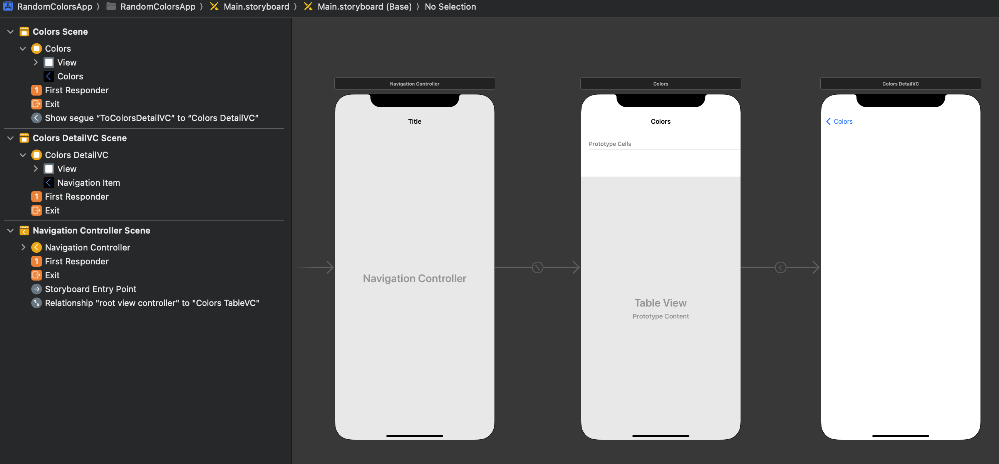
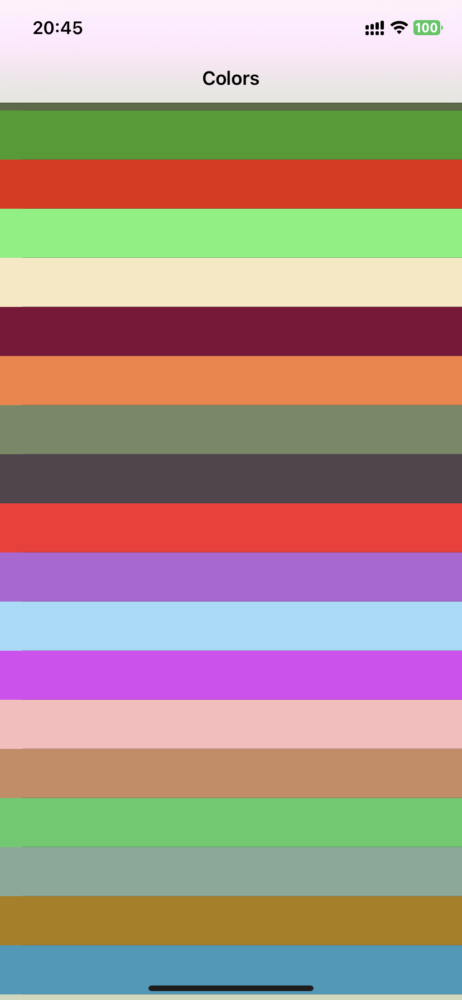
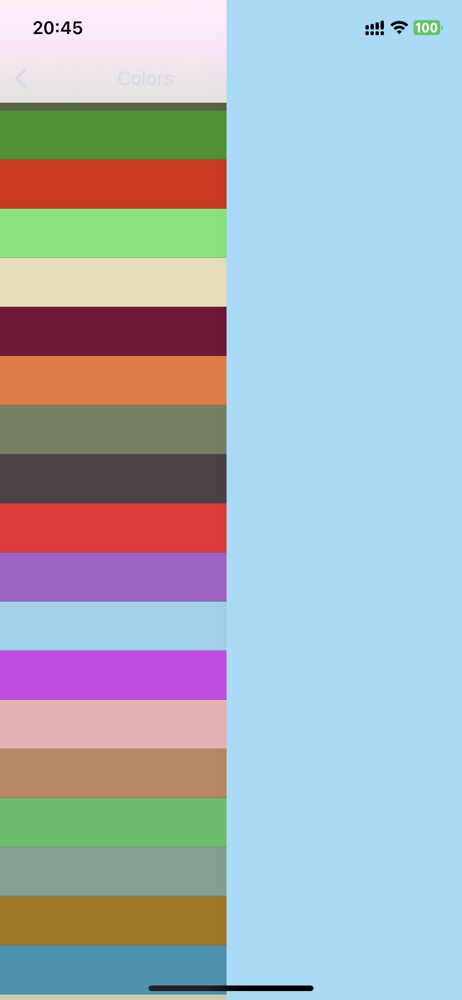
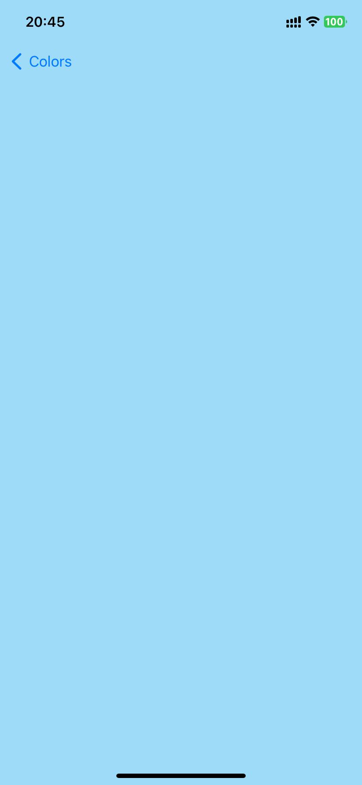

# Random Colors App for recalling UIkit and Storyboard manipulation

## Description

This app is a simple app that generates a list of random colors and displays them in a table view. Users can click on a color to see a detail view of the color.

## Involved Technologies

- UIKit
- Storyboard
  - TableView
  - Navigation Controller
  - Segue
- Swift

## Screenshots

<!-- use HTML to display three image in a line and center it -->

  

  
  
  

## Acknowledgements

- [Sean Allen](seanallen.teachable.com)
